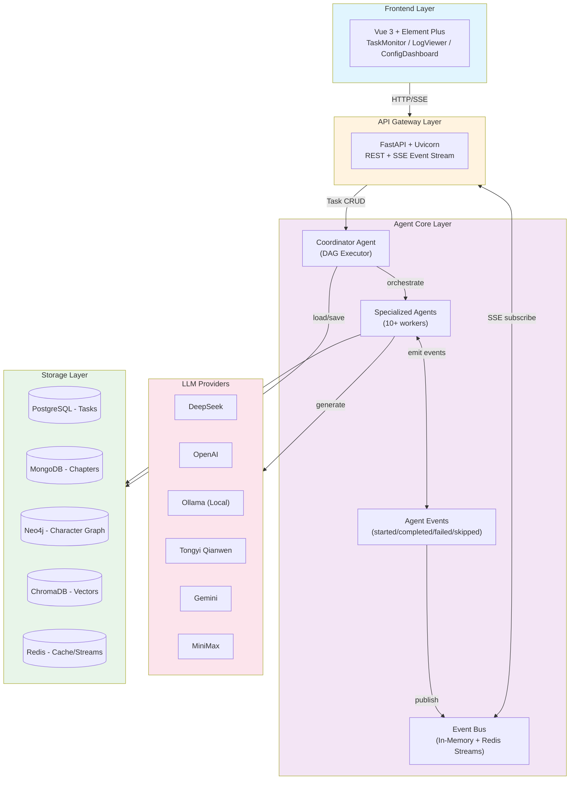

<div align="center">

# AI-Novels

**Multi-Agent 智能小说生成系统 — AI-powered Novel Generation Platform**

[](https://www.python.org/)
[](https://fastapi.tiangolo.com/)
[](https://vuejs.org/)
[](LICENSE)
[](https://github.com/psf/black)
[](#-测试)

</div>

---

## 📖 项目简介

AI-Novels 是一个基于 **Multi-Agent 架构** 的智能小说生成系统。系统通过协调多个专业 AI 智能体（Agent）协同工作，实现从故事构思到完整章节生成的一站式小说创作流程。

### ✨ 核心特性

- **Multi-Agent 协作** — 10+ 专业智能体分工协作，涵盖角色设计、世界观构建、大纲规划、内容生成、质量检查等环节
- **DAG 工作流引擎** — 基于有向无环图的任务编排，支持并行章节生成与依赖管理，自动跳过非关键失败节点
- **事件驱动架构** — Event Bus + Redis Streams 实现组件解耦与异步通信，全量执行事件实时推送
- **异构数据存储** — PostgreSQL + MongoDB + Neo4j + ChromaDB + Qdrant 多数据库协同
- **多模型支持** — Ollama、OpenAI、通义千问、Gemini、MiniMax、**DeepSeek** 等多种 LLM 提供商，可运行时切换
- **实时监控** — Agent 级活动流追踪、LLM 调用状态监控、章节生成进度可视化、分页日志浏览
- **现代化 UI** — Vue 3 + Element Plus + TypeScript 构建的毛玻璃玻璃设计响应式界面

---

## 🏗 系统架构



---

## 🚀 快速开始

### 环境要求

- Python 3.12+
- Node.js 18+
- Docker & Docker Compose 或 手动安装 PostgreSQL / Redis / Neo4j
- DeepSeek API key（推荐）或 Ollama（本地模型）/ OpenAI API key

### 手动部署（开发）

```bash
# 1. 克隆项目
git clone https://github.com/Ryan-0625/AI-Novels.git
cd AI-Novels

# 2. 配置环境变量
cp config/.env.example config/.env
# 编辑 config/.env 填入 LLM API 密钥
# 编辑 config/llm.json 选择默认 LLM 提供商

# 3. 后端
python -m venv venv
source venv/bin/activate  # Windows: venv\Scripts\activate
pip install -r requirements.txt
python start_server.py
# 后端 API → http://localhost:8004
# API 文档 → http://localhost:8004/docs

# 4. 前端（新终端）
cd frontend
npm install
npm run dev
# 前端界面 → http://localhost:3000
```

---

## 📁 项目结构

```
AI-Novels/
├── src/
│   └── ai_novels/                    # 后端核心代码
│       ├── agents/                   # Agent 智能体
│       │   ├── coordinator.py        # 协调器（DAG 工作流引擎）
│       │   ├── task_orchestrator.py  # 任务编排与线程池管理
│       │   ├── content_generator.py  # 章节内容生成与提示词构建
│       │   ├── outline_planner.py    # 大纲规划与章节标题生成
│       │   ├── character_generator.py # 角色设计与关系图谱
│       │   ├── world_builder.py      # 世界观/地理/力量体系
│       │   ├── config_enhancer.py    # 生成参数优化
│       │   ├── quality_checker.py    # 内容质量审核
│       │   ├── humanizer.py          # 文本润色（去AI痕迹）
│       │   ├── chapter_summary.py    # 章节摘要
│       │   ├── hook_generator.py     # 章末钩子
│       │   ├── conflict_generator.py # 冲突事件
│       │   ├── base.py               # Agent 基类与 LLM 事件发射
│       │   └── agent_communicator.py # Agent 间消息通信
│       ├── api/                      # FastAPI 路由层
│       │   ├── main.py               # 应用入口 + SSE 事件流
│       │   ├── controllers.py        # 业务逻辑控制器
│       │   └── routes/               # task / agent / config / health / log 路由
│       ├── core/                     # 核心基础设施
│       │   ├── event_bus.py          # 异步事件总线（发布/订阅）
│       │   ├── redis_event_bus.py    # Redis Streams 持久化事件总线
│       │   └── llm_router.py         # LLM 路由、客户端适配器与多云切换
│       ├── config/                   # Pydantic Settings 配置管理
│       ├── database/                 # 多数据库客户端工厂
│       ├── llm/                      # LLM 缓存与调用追踪
│       ├── messaging/                # RocketMQ 消息队列
│       ├── models/                   # SQLModel ORM 模型
│       └── utils/                    # Structlog / ID生成 / 健康检查
├── frontend/                         # Vue 3 前端
│   ├── src/
│   │   ├── components/              # 公共组件库
│   │   │   ├── GenerationMonitor.vue  # 实时生成状态卡片
│   │   │   ├── AgentActivityFeed.vue  # Agent 活动时间线
│   │   │   ├── DagVisualizer.vue      # DAG 可视化
│   │   │   ├── ChapterProgressGrid.vue# 章节进度网格
│   │   │   ├── GenerationTimeline.vue # 生成时间线
│   │   │   ├── GenerationStats.vue    # 生成统计面板
│   │   │   └── SystemHealthPanel.vue  # 系统健康状态
│   │   ├── views/                   # 页面视图
│   │   │   ├── TaskMonitorView.vue    # 任务监控 + SSE 实时流
│   │   │   ├── TaskCreationView.vue   # 创建生成任务
│   │   │   ├── TaskDashboardView.vue  # 任务总览面板
│   │   │   ├── NovelPreviewView.vue   # 小说内容预览
│   │   │   ├── NovelGenerationView.vue# 生成进度跟踪
│   │   │   ├── ConfigDashboardView.vue# 配置管理中心
│   │   │   ├── LogViewerView.vue      # 分页日志浏览器
│   │   │   └── SystemHealthView.vue   # 系统健康详情
│   │   ├── stores/                  # Pinia 状态管理
│   │   ├── services/                # API 客户端（axios + SSE）
│   │   └── utils/                   # 工具函数
│   └── ...
├── config/                            # 配置文件目录
│   ├── .env.example                  # 环境变量模板
│   ├── llm.json                      # LLM 提供商配置
│   ├── app_config.json               # 应用级配置
│   ├── database.json.template        # 数据库连接配置
│   ├── prometheus/                   # Prometheus 抓取配置
│   └── init/                         # 数据库初始化脚本
├── tests/                             # 测试套件（262+）
├── scripts/                           # 运维与部署脚本
├── docker-compose.yml                 # 开发环境 Docker 编排
├── Dockerfile.backend                 # 后端容器镜像
├── pyproject.toml                     # Python 项目元数据
└── requirements.txt                   # Python 依赖清单
```

---

## 🤖 Agent 工作流

系统通过 **6 阶段 DAG 工作流** 编排智能体：

```mermaid
graph LR
    subgraph Init["① 初始化"]
        CE["ConfigEnhancer<br/>配置增强"]
    end
    subgraph Plan["② 规划"]
        OP["OutlinePlanner<br/>大纲规划"]
        CG["CharacterGenerator<br/>角色生成"]
        WB["WorldBuilder<br/>世界观构建"]
    end
    subgraph Exec["③ 执行素材"]
        CS["ChapterSummary<br/>章节摘要"]
        HG["HookGenerator<br/>钩子生成"]
        CF["ConflictGenerator<br/>冲突设计"]
    end
    subgraph Gen["④ 内容生成"]
        CT["ContentGenerator<br/>逐章生成 ↑"]
    end
    subgraph QC["⑤ 质量"]
        QCH["QualityChecker<br/>质量检查 ⚡"]
    end
    subgraph Polish["⑥ 润色"]
        HZ["Humanizer<br/>文本润色 ⚡"]
    end

    Init --> Plan --> Exec --> Gen --> QC --> Polish

    style Init fill:#e8f5e9
    style Plan fill:#e3f2fd
    style Exec fill:#fff3e0
    style Gen fill:#f3e5f5
    style QC fill:#fce4ec
    style Polish fill:#f5f5f5
```



> ⚡ = 非关键节点，失败自动跳过，不影响工作流继续执行

| 阶段 | Agent | 职责 | 关键依赖 |
|------|-------|------|----------|
| ① 初始化 | **ConfigEnhancer** | LLM 提取主角、角色、世界观、风格 | — |
| ② 规划 | **OutlinePlanner** | 章节大纲与 LLM 生成标题 | 增强配置 |
| ② 规划 | **CharacterGenerator** | 角色设定、关系图谱 | 大纲 |
| ② 规划 | **WorldBuilder** | 地理、力量体系、阵营 | 大纲 |
| ③ 素材 | **ChapterSummary** | 每章核心要点 | 规划完成 |
| ③ 素材 | **HookGenerator** | 情节悬念钩子 | 规划完成 |
| ③ 素材 | **ConflictGenerator** | 人物冲突与转折事件 | 角色+世界 |
| ④ 生成 | **ContentGenerator** | 逐章撰写（并行章节） | 全部素材就绪 |
| ⑤ 质量 | **QualityChecker** ⚡ | 连贯性、风格一致性 | 内容生成 |
| ⑥ 润色 | **Humanizer** ⚡ | 去 AI 痕迹、句式多样性 | 内容生成 |

---

## 📡 事件系统与监控

系统内置完整的事件发布-订阅机制，每个 Agent 执行的每一步都实时推送至前端：

| 事件类型 | 来源 | 说明 |
|----------|------|------|
| `agent.started` | Coordinator | Agent 开始执行 |
| `agent.completed` | Coordinator | Agent 执行成功，含耗时/输出摘要 |
| `agent.failed` | Coordinator | Agent 执行失败，含错误信息 |
| `agent.skipped` | Coordinator | 非关键节点失败后跳过 |
| `llm.request` | BaseAgent | LLM 调用开始，含 provider/model |
| `llm.response` | BaseAgent | LLM 调用成功 |
| `llm.error` | BaseAgent | LLM 调用失败 |
| `generation.log` | Coordinator | 各阶段详细日志（info/warning/success/error） |
| `chapter.content` | Coordinator | 章节内容实时预览 |
| `task.progress` | Controller | 总体进度更新 |

前端 **TaskMonitorView** 通过 SSE (`/api/v2/events`) 订阅所有事件，以时间线形式展示 Agent 活动流，并在底部日志浏览器中持久化记录。

---

## 📡 API 概览

| 端点 | 方法 | 说明 |
|------|------|------|
| `/api/v2/tasks` | POST | 创建生成任务 |
| `/api/v2/tasks` | GET | 获取任务列表 |
| `/api/v2/tasks/{id}` | GET | 获取任务状态 + 增强配置 |
| `/api/v2/tasks/{id}/action` | POST | 暂停/恢复/取消任务 |
| `/api/v2/tasks/{id}/chapters` | GET | 章节列表 |
| `/api/v2/agents` | GET | Agent 列表 |
| `/api/v2/agents/{name}` | GET | Agent 详情 |
| `/api/v2/events` | GET | **SSE 事件流**（实时推送） |
| `/api/v2/config` | GET/PUT | 配置管理 |
| `/api/v2/logs` | GET | 日志分类列表 |
| `/api/v2/logs/{category}` | GET | 分页日志内容 |
| `/api/v2/health` | GET | 系统健康检查 |
| `/health` | GET | 基础健康检查 |
| `/docs` | GET | Swagger 文档 |

---

## 🧪 测试

```bash
# 运行全部测试
pytest

# 运行特定模块测试
pytest tests/test_agents/
pytest tests/test_api/
pytest tests/test_config/

# 带覆盖率报告
pytest --cov=src/ai_novels tests/
```

---

## 🛠 技术栈

### 后端
| 类别 | 技术 |
|------|------|
| Web 框架 | FastAPI + Uvicorn |
| AI/LLM | OpenAI SDK, DeepSeek API, Ollama, DashScope, Google Generative AI |
| 数据库 | PostgreSQL (SQLModel + Alembic), MongoDB (PyMongo), Neo4j, ChromaDB, Qdrant |
| 事件总线 | 异步 EventBus + Redis Streams |
| 日志 | Structlog（结构化JSON） |
| 消息队列 | RocketMQ |

### 前端
| 类别 | 技术 |
|------|------|
| 框架 | Vue 3 + TypeScript |
| UI 库 | Element Plus |
| 状态管理 | Pinia |
| 构建 | Vite |
| 实时通信 | EventSource (SSE) |

### 运维
| 类别 | 技术 |
|------|------|
| 容器化 | Docker Compose |
| 监控 | Prometheus + Grafana |
| CI/CD | GitHub Actions |

---

## 🤝 贡献

1. Fork 本项目
2. 创建特性分支 (`git checkout -b feature/amazing-feature`)
3. 提交更改 (`git commit -m 'feat: add amazing feature'`)
4. 推送分支 (`git push origin feature/amazing-feature`)
5. 创建 Pull Request

提交信息遵循 [Conventional Commits](https://www.conventionalcommits.org/) 规范。

---

## 📄 许可证

本项目采用 [MIT](LICENSE) 许可证。

---

<div align="center">

**Made by AI-Novels Team**

</div>
