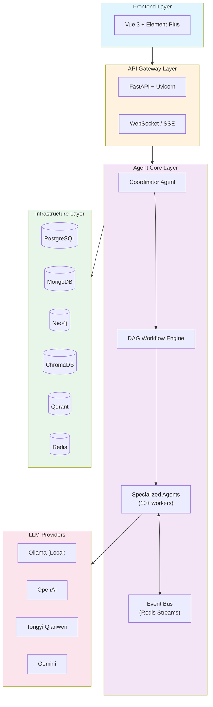

<div align="center">

# AI-Novels

**Multi-Agent 智能小说生成系统 — AI-powered Novel Generation Platform**

[](https://www.python.org/)
[](https://fastapi.tiangolo.com/)
[](https://vuejs.org/)
[](LICENSE)
[](https://github.com/psf/black)
[](#-测试)

</div>

---

## 项目简介

AI-Novels 是一个基于 **Multi-Agent 架构** 的智能小说生成系统。系统通过协调多个专业 AI 智能体（Agent）协同工作，实现从故事构思到完整章节生成的一站式小说创作流程。

### 核心特性

- **Multi-Agent 协作** — 10+ 专业智能体分工协作，涵盖角色设计、世界观构建、大纲规划、内容生成、质量检查等环节
- **DAG 工作流引擎** — 基于有向无环图的任务编排，支持并行章节生成与依赖管理
- **事件驱动架构** — Event Bus + Redis Streams 实现组件解耦与异步通信
- **异构数据存储** — PostgreSQL + MySQL + MongoDB + Neo4j + ChromaDB + Qdrant 多数据库协同
- **多模型支持** — Ollama、OpenAI、通义千问、Gemini、MiniMax、DeepSeek 等多种 LLM 提供商
- **实时监控** — 任务进度追踪、系统健康状态、Prometheus 指标、Grafana 仪表盘
- **现代化 UI** — Vue 3 + Element Plus + TypeScript 构建的响应式界面

---

## 系统架构



---

## 快速开始

### 环境要求

- Python 3.12+
- Node.js 18+
- Docker & Docker Compose（推荐）或 手动安装 PostgreSQL / Redis / Neo4j 等
- Ollama（本地模型）或 LLM API 密钥

### Docker 部署（推荐）

```bash
# 1. 克隆项目
git clone https://github.com/Laihuiwen/AI-Novels.git
cd AI-Novels

# 2. 配置环境变量
cp config/.env.example config/.env
# 编辑 config/.env 填入 API 密钥

# 3. 启动基础设施
docker compose up -d

# 4. 启动应用（含前端）
docker compose --profile app up -d

# 5. 访问
# 后端 API: http://localhost:8000
# 前端界面: http://localhost:5173
# API 文档: http://localhost:8000/docs
```

### 手动部署

```bash
# 后端
python -m venv venv
source venv/bin/activate  # Windows: venv\Scripts\activate
pip install -r requirements.txt
python start_server.py

# 前端（新终端）
cd frontend
npm install
npm run dev
```

---

## 项目结构

```
AI-Novels/
├── src/
│   └── ai_novels/              # 后端核心代码
│       ├── agents/              # Agent 智能体实现
│       │   ├── coordinator.py   # 协调器 Agent（DAG 工作流）
│       │   ├── task_orchestrator.py  # 任务编排器
│       │   ├── content_generator.py  # 内容生成
│       │   ├── character_generator.py # 角色生成
│       │   ├── world_builder.py      # 世界观构建
│       │   └── ...
│       ├── api/                 # FastAPI 路由层
│       │   ├── main.py          # 应用入口
│       │   ├── controllers.py   # 业务逻辑
│       │   └── routes/          # 路由模块
│       ├── core/                # 核心基础设施
│       │   ├── event_bus.py     # 内存事件总线
│       │   └── redis_event_bus.py # Redis 持久化事件总线
│       ├── config/              # 配置管理（Pydantic Settings）
│       ├── database/            # 数据库客户端
│       ├── llm/                 # LLM 路由与适配
│       ├── messaging/           # 消息队列
│       ├── models/              # SQLModel ORM 模型
│       └── utils/               # 工具函数
├── frontend/                    # Vue 3 前端
│   ├── src/
│   │   ├── components/         # 公共组件
│   │   ├── views/              # 页面视图
│   │   ├── stores/             # Pinia 状态管理
│   │   └── services/           # API 客户端
│   └── ...
├── config/                      # 配置文件
│   ├── .env.example            # 环境变量模板
│   ├── prometheus/             # Prometheus 配置
│   └── init/                   # 数据库初始化脚本
├── tests/                       # 测试套件（262+ 测试）
│   ├── test_agents/
│   ├── test_api/
│   ├── test_config/
│   └── ...
├── scripts/                     # 运维脚本
├── docker-compose.yml           # Docker 编排（开发）
├── docker-compose.prod.yml      # Docker 编排（生产）
├── Dockerfile.backend           # 后端容器镜像
├── Dockerfile.frontend          # 前端容器镜像
├── pyproject.toml               # 项目元数据
├── requirements.txt             # Python 依赖
└── start_server.py              # 启动脚本
```

---

## Agent 架构

系统包含以下核心智能体，通过 DAG 工作流引擎编排：

| Agent | 职责 | 依赖 |
|-------|------|------|
| **Coordinator** | 工作流编排、任务分发、DAG 执行 | 全部 Agent |
| **OutlinePlanner** | 生成小说大纲、章节规划 | — |
| **CharacterGenerator** | 创建角色设定、关系图谱 | OutlinePlanner |
| **WorldBuilder** | 构建世界观、力量体系、地理 | OutlinePlanner |
| **ConfigEnhancer** | 优化生成参数与风格配置 | OutlinePlanner |
| **ContentGenerator** | 章节内容撰写 | 上述全部完成 |
| **ChapterSummaryAgent** | 章节摘要生成 | ContentGenerator |
| **QualityChecker** | 内容质量审核与一致性检查 | ContentGenerator |
| **HookGenerator** | 章末钩子生成 | ContentGenerator |
| **ConflictGenerator** | 冲突事件生成 | CharacterGenerator + WorldBuilder |

---

## API 概览

| 端点 | 方法 | 说明 |
|------|------|------|
| `/api/v2/tasks` | POST | 创建生成任务 |
| `/api/v2/tasks/{id}` | GET | 获取任务状态 |
| `/api/v2/tasks/{id}/cancel` | POST | 取消任务 |
| `/api/v2/agents` | GET | 获取 Agent 列表 |
| `/api/v2/agents/{name}` | GET | 获取 Agent 详情 |
| `/api/v2/config` | GET | 获取配置 |
| `/api/v2/config` | PUT | 更新配置 |
| `/api/v2/events` | GET | SSE 事件流 |
| `/api/v2/health` | GET | 健康检查 |
| `/api/v2/logs` | GET | 日志查询 |
| `/health` | GET | 基础健康检查 |
| `/docs` | GET | Swagger 文档 |
| `/redoc` | GET | ReDoc 文档 |

---

## 测试

```bash
# 运行全部测试
pytest

# 运行特定模块测试
pytest tests/test_agents/
pytest tests/test_api/
pytest tests/test_config/

# 带覆盖率
pytest --cov=src/ai_novels tests/
```

---

## 技术栈

### 后端
- **Web 框架**: FastAPI + Uvicorn
- **AI/LLM**: OpenAI SDK, Ollama, DashScope, Google Generative AI
- **数据库**: SQLAlchemy + asyncpg, PyMongo, Neo4j Driver, ChromaDB, Qdrant
- **事件总线**: Redis Streams
- **ORM**: SQLModel + Alembic
- **配置**: Pydantic Settings v2
- **日志**: Structlog

### 前端
- **框架**: Vue 3 + TypeScript
- **UI 库**: Element Plus
- **状态管理**: Pinia
- **构建工具**: Vite

### 运维
- **容器化**: Docker Compose
- **监控**: Prometheus + Grafana
- **CI**: GitHub Actions

---

## 贡献

1. Fork 本项目
2. 创建特性分支 (`git checkout -b feature/amazing-feature`)
3. 提交更改 (`git commit -m 'feat: add amazing feature'`)
4. 推送分支 (`git push origin feature/amazing-feature`)
5. 创建 Pull Request

提交信息遵循 [Conventional Commits](https://www.conventionalcommits.org/) 规范。

---

## 许可证

本项目采用 [MIT](LICENSE) 许可证。

---

<div align="center">

**Made by AI-Novels Team**

</div>
